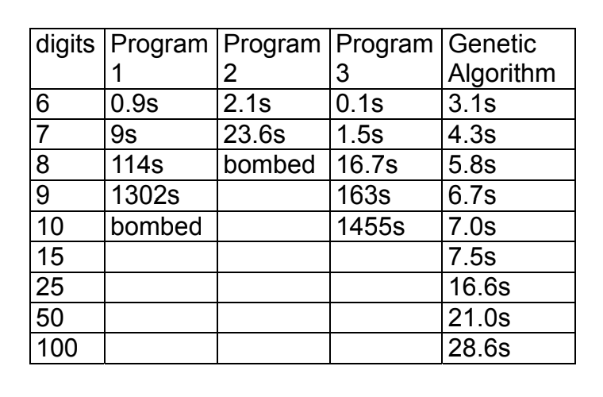

# Genetic Algorithm

My Genetic Algorithm project was selected as a finalist in the GT competition and advanced to the district showcase.

## Description

I implemented a **Genetic Algorithm** in Java  to tackle optimization problems, specifically focusing on cracking a 10-digit combination. The goal was to demonstrate the efficiency and applicability of genetic algorithms in solving complex problems, such as deciphering codes, compared to traditional methods.

## Runtime

To evaluate the effectiveness of the algorithm, I conducted a performance analysis by comparing its runtime to several other programs, including a brute force approach. This comparison highlighted the significant efficiency gains offered by genetic algorithms in solving large-scale optimization problems. The results are documented below to demonstrate the algorithm’s potential in real-world applications.



## Video Demonstration 

You can view a demonstration of the project here: 

[](https://youtu.be/0FS5JPx2OOI)

## Executing the Program
1. Clone this repository to your local machine.
2. Ensure that **Java** is installed on your system. You can verify this by running ``` java -version ``` in your terminal.
3. Navigate to the Genetic Algorithm folder where the program is located.
4. In the terminal, execute the following command to run the program: ``` java SafeCracker.java ```
5. Next, input the combination you would like cracked. The output should look something like this:

